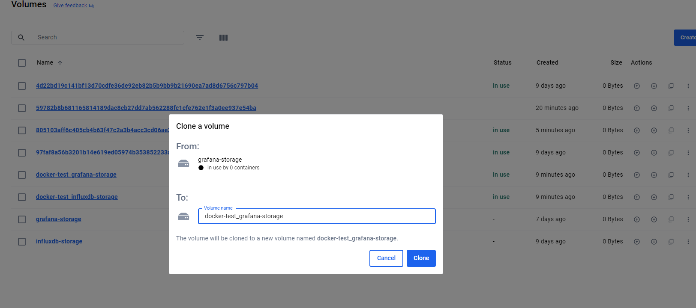

# 도커 컴포즈 사용기

#### 도커 컴포즈 yml 설정 실행

```
docker-compose up -d
```

#### 도커 컴포즈 종료

```
docker-compose down
```

#### 특정 모듈만 재시작

```
docker-compose restart nginx
```

#### 로그 확인

```
docker logs nginx
```


#### 도커 볼륨 목록

```
docker volume ls
```

#### 도커 네트워크 목록 조회

```
docker network ls
docker network inspect grafana-network
```


## 도커 사용하면서 알게된 것들

#### 볼륨 이슈

도커 컴포즈를 사용하니, 해당 프로젝트에 대한 볼륨도 구성이 됐다.

```
C:\Users\Yeom\IdeaProjects\blog\modules\docker-test>docker volume ls
DRIVER    VOLUME NAME
local     4d22bd19c141bf13d70cdfe36de92eb82b5b9bb9b21690ea7ad8d6756c797b04
local     97faf8a56b3201b14e619ed05974b353852233ab817a7bd20251648171b94738
local     59782b8b681165814189dac8cb27dd7ab562288fc1cfe762e1f3a0ee937e54ba
local     docker-test_grafana-storage
local     docker-test_influxdb-storage
local     grafana-storage
local     influxdb-storage
```

기존에 그냥 도커로 사용할 때는 grafana-storage 이와같은 볼륨을 만들어서 사용했는데, 

docker-test 프로젝트 내에서 docker-compose.yml 파일 설정하고 실행 해보니, docker-test_grafana-storage가 생성 되었다.

그래서 기존 볼륨을 복제 뜰 수 있는 방법을 찾아보다가, docker desktop에서 clone이 있어서 해당 기능을 사용해

쉽게 복제를 했다.



