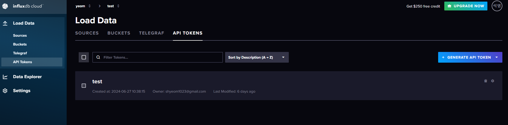
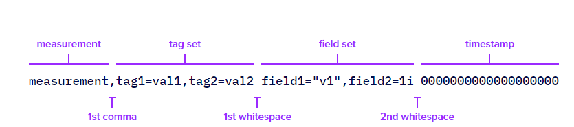

# InfluxDB V3 + Spring Boot + Kotlin 프로젝트

### GitHub InfluxDB V3 공식 내용

https://github.com/InfluxCommunity/influxdb3-java


문서 내용은 최신화된 내용이 없어서 삽질을 엄청 함... 차라리 github 문서만 봐도 구현이 가능

자바로 구현되어 있지만, 조금만 custom하면 kotlin에서 수행할 수 있도록 가능


#### build.gradle.kts

```
plugins {
    id("org.springframework.boot") version Versions.springBoot
}

dependencies {

    implementation("org.springframework.boot:spring-boot-starter-web")


    // influx
    implementation("com.influxdb:influxdb3-java:0.8.0")


    testImplementation("org.springframework.boot:spring-boot-starter-test")
}

```


현재 가장 최신 버전인 `com.influxdb:influxdb3-java:0.8.0` 를 사용


### InfluxDB V3 Config

DB Config는 아래와 같이 설정해서 influxDbConfig를 DI해서 사용할 수 있도록 구현

```
package com.example.blog.v3.influx.infra.config

import com.influxdb.v3.client.InfluxDBClient
import org.springframework.context.annotation.Bean
import org.springframework.context.annotation.Configuration

@Configuration
class InfluxDBConfig {

    @Bean
    fun influxDBClient(): InfluxDBClient {
        val host = "https://us-east-1-1.aws.cloud2.influxdata.com"
        val database = "test"
        val token = "INFLUX-TOKEN".toCharArray()

        return InfluxDBClient.getInstance(host, token, database)
    }
}
```


### 토큰 발급 방법

현재 필자는 server less 형태로 해서 influx에서 제공한 cloud 형태로 개발 진행 중

host로 들어가서 로그인 후 Load Data > API Tokens > Generate API TOKEN 클릭하면 생성 가능




### InfluxDB Write 방법

https://github.com/InfluxCommunity/influxdb3-java

https://docs.influxdata.com/influxdb/cloud-serverless/get-started/write/

#### Point

influxDB에 insert 하기위해서 정형화된 객체가 Point 이다.

Point를 사용하면, 명확하게 어떤 데이터를 insert 하는지 정의할 수 있다.

```
fun writePoint() {
        val point: Point = Point.measurement("temperature")
            .setTag("location", "west")
            .setField("value", 55.15)
            .setTimestamp(Instant.now().minusSeconds(-10))
        influxDBClient.writePoint(point)
    }
```

#### Line



위 그림과 같은 구분자로 데이터를 넣을 수 있다.

```
	fun writeLineProtocol() {
        val records = listOf(
            "temperature,location=north value=60.0",
            "temperature,location=north value=70.0",
            "temperature,location=north value=80.0"
        )

        records.forEach { record ->
            influxDBClient.writeRecord(record)
            println("Data has been written successfully: $record")
        }
    }
```

### 

### InfluxDB Select 방법

select를 할때 오류가 발생해서 해당 내용은 InfluxDB + Spring Boot 연동시 에러내용 정리에 적어놨습니다.

그래서 select 하는 방법은 매우 심플하다

#### select Field 순서대로 가져오기

```
    fun selectSql() {
        try {
            val sql = "select time,location,value from temperature order by time desc limit 10"
            influxDBClient.query(sql).use { stream ->
                val resultList = stream.collect(Collectors.toList())
                resultList.forEach { row ->
                    log.info(
                        "| {}\t| {}\t| {}\t|",
                        String.format("%-8s", row.get(1)),
                        String.format("%-8s", row.get(2)),
                        String.format("%-30s", row.get(0))
                    )
                }
            }
        } catch (e: Exception) {
            log.error("Exception: {}", e.message, e)
        }
    }
```

#### Select 결과를 Point로 변환해서 값 가져오기

```
    fun selectSqlWithPoint() {
        try {
            val sql = "select time,location,value from temperature order by time desc limit 10"
            influxDBClient.queryPoints(sql, QueryOptions.DEFAULTS).use { stream ->
                val resultList = stream.collect(Collectors.toList())
                resultList.forEach { p ->
                    val time = p.timestamp?.toLong() ?: 0L
                    log.info(
                        "| {}\t| {}\t| {}\t|",
                        String.format("%-8s", p.getTag("location")),
                        String.format("%-8s", p.getField("value")),
                        LocalDateTime.ofInstant(
                            Instant.ofEpochSecond(time / 1_000_000_000, time % 1_000_000_000),
                            ZoneId.systemDefault()
                        )
                    )
                }
            }
        } catch (e: Exception) {
            log.error("Exception: {}", e.message, e)
        }
    }
```


### InfluxDB + Spring Boot 연동시 MemoryUtil 에러내용 정리

#### 1. by: java.lang.RuntimeException: Failed to initialize MemoryUtil. You must start Java with --add-opens=java.base/java.nio=ALL-UNNAMED

해당 에러는 influxDB의 select를 하다가 에러가 발생했다.

정확히 해당 에러가 무엇인지는 잘 모르겠지만, 에러를 해결하기 위한 방법을 적어놨다.

```
2024-07-04 11:17:50.687 ERROR 320 --- [    Test worker] c.e.b.v.i.api.service.InfluxV3Service    : Exception: Failed to read message.

org.apache.arrow.flight.FlightRuntimeException: Failed to read message.
	at org.apache.arrow.flight.CallStatus.toRuntimeException(CallStatus.java:131) ~[flight-core-15.0.2.jar:15.0.2]
	at org.apache.arrow.flight.grpc.StatusUtils.fromGrpcRuntimeException(StatusUtils.java:164) ~[flight-core-15.0.2.jar:15.0.2]
	at org.apache.arrow.flight.grpc.StatusUtils.fromThrowable(StatusUtils.java:185) ~[flight-core-15.0.2.jar:15.0.2]
	at org.apache.arrow.flight.FlightStream$Observer.onError(FlightStream.java:456) ~[flight-core-15.0.2.jar:15.0.2]
	at org.apache.arrow.flight.FlightClient$1.onError(FlightClient.java:350) ~[flight-core-15.0.2.jar:15.0.2]
	at io.grpc.stub.ClientCalls$StreamObserverToCallListenerAdapter.onClose(ClientCalls.java:481) ~[grpc-stub-1.60.0.jar:1.60.0]
	at io.grpc.PartialForwardingClientCallListener.onClose(PartialForwardingClientCallListener.java:39) ~[grpc-api-1.60.0.jar:1.60.0]
	at io.grpc.ForwardingClientCallListener.onClose(ForwardingClientCallListener.java:23) ~[grpc-api-1.60.0.jar:1.60.0]
	at io.grpc.ForwardingClientCallListener$SimpleForwardingClientCallListener.onClose(ForwardingClientCallListener.java:40) ~[grpc-api-1.60.0.jar:1.60.0]
	at org.apache.arrow.flight.grpc.ClientInterceptorAdapter$FlightClientCallListener.onClose(ClientInterceptorAdapter.java:117) ~[flight-core-15.0.2.jar:15.0.2]
	at io.grpc.internal.ClientCallImpl.closeObserver(ClientCallImpl.java:574) ~[grpc-core-1.60.0.jar:1.60.0]
	at io.grpc.internal.ClientCallImpl.access$300(ClientCallImpl.java:72) ~[grpc-core-1.60.0.jar:1.60.0]
	at io.grpc.internal.ClientCallImpl$ClientStreamListenerImpl$1StreamClosed.runInternal(ClientCallImpl.java:742) ~[grpc-core-1.60.0.jar:1.60.0]
	at io.grpc.internal.ClientCallImpl$ClientStreamListenerImpl$1StreamClosed.runInContext(ClientCallImpl.java:723) ~[grpc-core-1.60.0.jar:1.60.0]
	at io.grpc.internal.ContextRunnable.run(ContextRunnable.java:37) ~[grpc-core-1.60.0.jar:1.60.0]
	at io.grpc.internal.SerializingExecutor.run(SerializingExecutor.java:133) ~[grpc-core-1.60.0.jar:1.60.0]
	at java.base/java.util.concurrent.ThreadPoolExecutor.runWorker(ThreadPoolExecutor.java:1144) ~[na:na]
	at java.base/java.util.concurrent.ThreadPoolExecutor$Worker.run(ThreadPoolExecutor.java:642) ~[na:na]
	at java.base/java.lang.Thread.run(Thread.java:1589) ~[na:na]
Caused by: java.lang.ExceptionInInitializerError: null
	at org.apache.arrow.memory.ArrowBuf.getDirectBuffer(ArrowBuf.java:229) ~[arrow-memory-core-15.0.2.jar:15.0.2]
	at org.apache.arrow.memory.ArrowBuf.nioBuffer(ArrowBuf.java:224) ~[arrow-memory-core-15.0.2.jar:15.0.2]
	at org.apache.arrow.flight.grpc.GetReadableBuffer.readIntoBuffer(GetReadableBuffer.java:91) ~[flight-core-15.0.2.jar:15.0.2]
	at org.apache.arrow.flight.ArrowMessage.frame(ArrowMessage.java:319) ~[flight-core-15.0.2.jar:15.0.2]
	at org.apache.arrow.flight.ArrowMessage.access$100(ArrowMessage.java:68) ~[flight-core-15.0.2.jar:15.0.2]
	at org.apache.arrow.flight.ArrowMessage$ArrowMessageHolderMarshaller.parse(ArrowMessage.java:551) ~[flight-core-15.0.2.jar:15.0.2]
	at org.apache.arrow.flight.ArrowMessage$ArrowMessageHolderMarshaller.parse(ArrowMessage.java:536) ~[flight-core-15.0.2.jar:15.0.2]
	at io.grpc.MethodDescriptor.parseResponse(MethodDescriptor.java:284) ~[grpc-api-1.60.0.jar:1.60.0]
	at io.grpc.internal.ClientCallImpl$ClientStreamListenerImpl$1MessagesAvailable.runInternal(ClientCallImpl.java:667) ~[grpc-core-1.60.0.jar:1.60.0]
	at io.grpc.internal.ClientCallImpl$ClientStreamListenerImpl$1MessagesAvailable.runInContext(ClientCallImpl.java:654) ~[grpc-core-1.60.0.jar:1.60.0]
	... 5 common frames omitted
Caused by: java.lang.RuntimeException: Failed to initialize MemoryUtil. You must start Java with --add-opens=java.base/java.nio=ALL-UNNAMED (See https://arrow.apache.org/docs/java/install.html)
	at org.apache.arrow.memory.util.MemoryUtil.<clinit>(MemoryUtil.java:143) ~[arrow-memory-core-15.0.2.jar:15.0.2]
	... 15 common frames omitted
Caused by: java.lang.reflect.InaccessibleObjectException: Unable to make field long java.nio.Buffer.address accessible: module java.base does not "opens java.nio" to unnamed module @16610890
	at java.base/java.lang.reflect.AccessibleObject.throwInaccessibleObjectException(AccessibleObject.java:387) ~[na:na]
	at java.base/java.lang.reflect.AccessibleObject.checkCanSetAccessible(AccessibleObject.java:363) ~[na:na]
	at java.base/java.lang.reflect.AccessibleObject.checkCanSetAccessible(AccessibleObject.java:311) ~[na:na]
	at java.base/java.lang.reflect.Field.checkCanSetAccessible(Field.java:180) ~[na:na]
	at java.base/java.lang.reflect.Field.setAccessible(Field.java:174) ~[na:na]
	at org.apache.arrow.memory.util.MemoryUtil.<clinit>(MemoryUtil.java:88) ~[arrow-memory-core-15.0.2.jar:15.0.2]
	... 15 common frames omitted

2024-07-04 11:17:50.723 ERROR 320 --- [ionShutdownHook] org.apache.arrow.memory.BaseAllocator    : Memory was leaked by query. Memory leaked: (512)
Allocator(flight-client) 0/512/512/9223372036854775807 (res/actual/peak/limit)

2024-07-04 11:17:50.723  WARN 320 --- [ionShutdownHook] o.s.b.f.support.DisposableBeanAdapter    : Invocation of close method failed on bean with name 'influxDBClient': java.lang.IllegalStateException: Memory was leaked by query. Memory leaked: (512)
Allocator(flight-client) 0/512/512/9223372036854775807 (res/actual/peak/limit)
```


현재 필자는 JAVA 1.8을 사용하고 있었다.

그리고 모듈 방식으로 사용하며, 부모 build.gradle.kts에 공통적인 plugin정의, java 버전 정의를 해서 사용중에 있다.

#### 부모 build.gradle.kts

```
import org.jetbrains.kotlin.gradle.tasks.KotlinCompile

plugins {
    kotlin("jvm") version Versions.kotlin
    kotlin("kapt") version Versions.kotlin
    id("io.spring.dependency-management") version Versions.springDependencyManagement
    id("org.jetbrains.kotlin.plugin.spring") version Versions.kotlin
}

allprojects {
    group = "com.example"
    repositories {
        mavenCentral()
    }
}

subprojects {
    apply {
        plugin("kotlin")
        plugin("kotlin-kapt")
        plugin("io.spring.dependency-management")
        plugin("kotlin-spring")
    }
    dependencies {
        implementation("com.fasterxml.jackson.module:jackson-module-kotlin")
        implementation("org.jetbrains.kotlin:kotlin-reflect")

        // junit
        testImplementation("org.junit.jupiter:junit-jupiter")
    }

    tasks {
        withType<KotlinCompile> {
            kotlinOptions {
                freeCompilerArgs = listOf("-Xjsr305=strict")
                jvmTarget = "1.8"
            }
        }

        withType<JavaCompile> {
            sourceCompatibility = "1.8"
            targetCompatibility = "1.8"
        }

        withType<Test> {
            useJUnitPlatform()
        }

    }
}
```


#### 자식 build.gradle.kts

```
plugins {
    id("org.springframework.boot") version Versions.springBoot
}

dependencies {

    implementation("org.springframework.boot:spring-boot-starter-web")


    // influx
    implementation("com.influxdb:influxdb3-java:0.8.0")


    testImplementation("org.springframework.boot:spring-boot-starter-test")
}
```


chatGPT에 찾아보니, 부모 build.gradle.kts jvmArgs("--add-opens=java.base/java.nio=ALL-UNNAMED") 해당 옵션을 추가하면 해결된다고 했다.

```
...
		withType<Test> {
            useJUnitPlatform()
            jvmArgs("--add-opens=java.base/java.nio=ALL-UNNAMED")
        }
...        
```


그랬더니 정말로 정상적으로 실행이 되었다.

```
2024-07-04 12:43:26.253  INFO 33400 --- [    Test worker] c.e.b.v.i.a.service.InfluxV3ServiceTest  : Starting InfluxV3ServiceTest using Java 11.0.23 on DESKTOP-6K5V7C1 with PID 33400 (started by Yeom in C:\Users\Yeom\IdeaProjects\blog\modules\influx-v3)
2024-07-04 12:43:26.255  INFO 33400 --- [    Test worker] c.e.b.v.i.a.service.InfluxV3ServiceTest  : The following 1 profile is active: "local"
2024-07-04 12:43:27.808  INFO 33400 --- [    Test worker] org.apache.arrow.memory.BaseAllocator    : Debug mode disabled. Enable with the VM option -Darrow.memory.debug.allocator=true.
2024-07-04 12:43:27.814  INFO 33400 --- [    Test worker] o.a.a.m.DefaultAllocationManagerOption   : allocation manager type not specified, using netty as the default type
2024-07-04 12:43:27.816  INFO 33400 --- [    Test worker] org.apache.arrow.memory.CheckAllocator   : Using DefaultAllocationManager at memory-netty/15.0.2/ac04f765aff89fde6fcb1e6256841f2f96ab18e6/arrow-memory-netty-15.0.2.jar!/org/apache/arrow/memory/DefaultAllocationManagerFactory.class
2024-07-04 12:43:29.505  INFO 33400 --- [    Test worker] c.e.b.v.i.a.service.InfluxV3ServiceTest  : Started InfluxV3ServiceTest in 3.732 seconds (JVM running for 6.22)
| north    | 80.0     | 2024-07-03T04:33:10.258208342  |
| north    | 70.0     | 2024-07-03T04:33:09.909547608  |
| north    | 60.0     | 2024-07-03T04:33:09.650730272  |
| north    | 60.0     | 2024-07-03T04:32:36.700101289  |
| west     | 55.15    | 2024-07-03T04:15:49.395460100  |
> Task :influx-v3:test

Deprecated Gradle features were used in this build, making it incompatible with Gradle 9.0.
```

